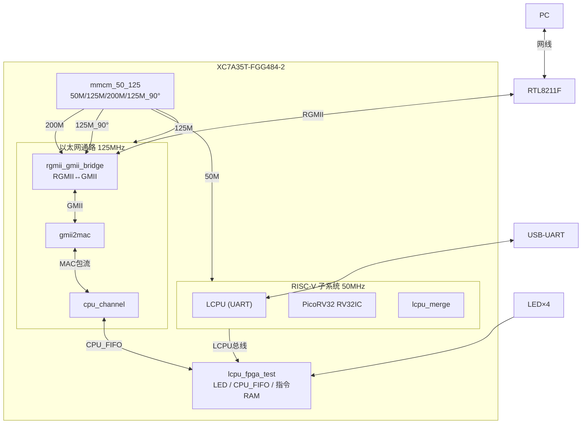

# RiscV WebSoC 逻辑设计方案

**文档编号**：ED002R01 | **版本**：V1.1 | **日期**：2026-07-28

| 项目 | 内容 |
|------|------|
| 产品名称 | RiscV WebSoC |
| 密级 | 内部 |
| FPGA | XC7A35T-FGG484-2 |
| PHY | RTL8211F (RGMII) |
| CPU | PicoRV32 (RV32IC) |
| 时钟 | mmcm_50_125 (MMCME2_BASE, 统一仿真/上板) |

---

## 修订记录

| 日期 | 版本 | 修改 | 作者 |
|------|------|------|------|
| 2026-07-27 | V1.0 | 初版 | haitaoz |
| 2026-07-28 | V1.1 | 统一mmcm_50_125, 寄存器0x6000, 回环验证 | haitaoz |

## 参考资料

1. [fpga_web 设计文档](https://buckfpga.uk/index_blog.php?post=fpga_web)
2. `fpga_cpu-master` — RISC-V SoC 参考
3. `lcpu_rgmii` — RGMII 数据通路参考
4. `ip_common/doc/常见标准接口时序.md`

---

# 1 总体架构

## 1.1 结构框图



## 1.2 数据流

**收包**: `PHY → RGMII → gmii2mac(CDC+CRC) → cpu_channel(RX_FIFO) → lcpu_fpga_test → RISC-V读取`

**发包**: `RISC-V写入 → lcpu_fpga_test → cpu_channel(TX_FIFO) → gmii2mac(CRC) → RGMII → PHY`

## 1.3 时钟域

| 时钟 | 频率 | 来源 | 使用者 |
|------|------|------|--------|
| clk_50m | 50 MHz | mmcm_50_125 CLKOUT3 | RISC-V, LCPU, lcpu_fpga_test |
| clk_125m | 125 MHz | mmcm_50_125 CLKOUT0 | gmii2mac, cpu_channel |
| clk_200m | 200 MHz | mmcm_50_125 CLKOUT1 | IDELAYCTRL |
| clk_125m_tx | 125MHz 90° | mmcm_50_125 CLKOUT2 | RGMII TX ODDR |
| rgmii_rxc | 125 MHz | PHY | gmii2mac CDC写侧 |

> **统一时钟管理**: 仿真和上板都使用 `rtl/mmcm_50_125.v`。仿真时 `sim/vendor_stubs.v` 提供 MMCME2_BASE 行为模型(直通+延时locked)，上板时使用真实 Xilinx MMCM 原语。`pll_50m` 已移除。

**MMCM 参数**:

| 参数 | 值 | 输出 |
|------|-----|------|
| CLKFBOUT_MULT_F | 20.0 | VCO=1000MHz |
| CLKOUT0_DIVIDE_F | 8.0 | 125MHz 0° |
| CLKOUT1_DIVIDE | 5 | 200MHz |
| CLKOUT2_DIVIDE_F | 8.0 | 125MHz 90° |
| CLKOUT3_DIVIDE_F | 20.0 | 50MHz |

## 1.4 模块层次树

```
webserver_cpu_top (顶层, 43 RTL文件)
├── mmcm_50_125 (MMCME2_BASE)
├── rgmii_gmii_bridge
│   ├── rgmii_to_gmii (IDELAYE2+IDDR)
│   └── gmii_to_rgmii (ODDR)
├── gmii2mac
│   ├── dual_clock_fifo (CDC)
│   ├── eth_presemble×2
│   ├── mac_rx (CRC32校验)
│   └── mac_tx (CRC32插入)
├── cpu_channel
│   ├── ram2pktfifo_int
│   ├── package_fifo_v2×2 (RX/TX)
│   ├── pktfifo2ram_int_v2
│   └── sop_eop_gen
├── lcpu_riscv_wrapper
│   ├── lcpu_top (UART)
│   ├── riscv32_top (PicoRV32, CATCH_MISALIGN=0)
│   │   ├── riscv32_localbus
│   │   ├── picorv32
│   │   ├── riscv32intfbridge
│   │   └── single_clock_true_dual_port_ram
│   └── lcpu_merge
└── lcpu_fpga_test
    └── ramintf
```

---

# 2 寄存器映射

## 2.1 系统寄存器

| 地址 | 寄存器 | 类型 | 说明 |
|------|--------|------|------|
| 0x00 | fpga_build_date | RO | FPGA编译日期 |
| 0x01 | fpga_build_time | RO | FPGA编译时间 |
| 0x02 | sw_build_date | RW | 固件版本日期 |
| 0x03 | sw_build_time | RW | 固件版本时间 |
| 0x04-0x0F | Scrach_RW_0~11 | RW | 调试暂存 |
| 0x10 | led[3:0] | RW | LED控制 |
| 0x11 | pll_locked | RO | PLL锁定 |
| 0x100 | riscv_reset_l | RW | RISC-V复位 |

## 2.2 CPU FIFO 寄存器

| 地址 | 寄存器 | 类型 | 说明 |
|------|--------|------|------|
| **RX (CPU读包)** | | | |
| 0x6000 | cpu_rd_empty | RO | 1=空,0=有包 |
| 0x6001 | cpu_rd_rpkt_pop | WC | 写1释放包 |
| 0x6002 | cpu_rd_rpkt_len | RO | 包长度(字节) |
| 0x6003 | cpu_rd_ren | RW | 读使能 |
| 0x6004 | cpu_rd_raddr | RW | 字节偏移 |
| 0x6005 | cpu_rd_rdata | RO | 读数据[7:0] |
| 0x6006 | cpu_rd_reop_pre | RO | EOP前1周期 |
| **TX (CPU发包)** | | | |
| 0x6100 | cpu_wr_full | RO | 1=FIFO满 |
| 0x6101 | cpu_wr_wen | WC | 写使能 |
| 0x6102 | cpu_wr_waddr | RW | 字节偏移 |
| 0x6103 | cpu_wr_wdata | RW | 写数据[7:0] |
| 0x6104 | cpu_wr_wpkt_len | RW | 包长度 |
| 0x6106 | cpu_wr_wpkt_push | WC | 写1推送发送 |

## 2.3 指令 RAM

| 地址范围 | 说明 |
|----------|------|
| 0x10000-0x1FFFF | 8K×32bit, 双端口Block RAM |

---

# 3 引脚分配 (XC7A35T-FGG484)

| 信号 | 引脚 | IOSTANDARD |
|------|------|------------|
| clk_50m_in | W19 | LVCMOS33 |
| reset_l | D21 | LVCMOS33 |
| uart_rx | L21 | LVCMOS33 |
| uart_tx | M21 | LVCMOS33 |
| led_o[3:0] | U22/V22/W21/W22 | LVCMOS33 |
| rgmii_txc | AB21 | LVCMOS33 |
| rgmii_txd[3:0] | AB20/Y19/AB22/W20 | LVCMOS33 |
| rgmii_tx_ctl | AA19 | LVCMOS33 |
| rgmii_rxc | Y18 | LVCMOS33 |
| rgmii_rxd[3:0] | P20/N15/AA18/AB18 | LVCMOS33 |
| rgmii_rx_ctl | T20 | LVCMOS33 |
| Eth0_MDC | R14 | LVCMOS33 |
| Eth0_MDIO | U21 | LVCMOS33 |
| rgmii_reset_l | P14 | LVCMOS33 |

---

# 4 时序约束

```tcl
# 输入 50MHz
create_clock -period 20.000 -name clk_50m_in [get_ports clk_50m_in]

# RGMII RXC (PHY, 异步)
create_clock -period 8.000 -name rgmii_rxc [get_ports rgmii_rxc]
set_false_path -from [get_clocks rgmii_rxc] -to [all_clocks]
set_false_path -to   [get_clocks rgmii_rxc] -from [all_clocks]

# MMCM 相移时钟组 (同源, ODDR/IDDR内部处理)
set_clock_groups -asynchronous \
    -group [get_clocks -include_generated clk_125m_unbuf] \
    -group [get_clocks -include_generated clk_125m_tx_unbuf]
```

---

# 5 C 固件

## 5.1 回环流程

```c
reset_entry(0x00) → program_main()
  ├─ designInit()       // LED=0, 写固件版本号
  └─ while(1) designApp()
       ├─ if (REG_RD_EMPTY == 0)   // 有包?
       │   ├─ len = REG_RD_LEN     // 读长度
       │   ├─ for(i=0;i<len;i++)   // 逐字节读
       │   │     buf[i] = rd_byte(i)
       │   ├─ REG_RD_POP = 1       // 释放
       │   ├─ led = ++pkt_cnt      // LED计数
       │   ├─ while(REG_WR_FULL)   // 等TX就绪
       │   ├─ for(i=0;i<len;i++)   // 逐字节写回
       │   │     wr_byte(i, buf[i])
       │   └─ REG_WR_PUSH = 1      // 发送
       └─ return
```

> **地址映射**: `LCPU_BASE=0x80000000`, struct成员偏移/4 = 硬件寄存器地址(已验证bus_addr=struct_offset/4)
> **CATCH_MISALIGN=0**: PicoRV32内部处理非对齐store, 固件可用任意地址
> **delay_time=1000**: BFM在复位释放后启动, 避免总线冲突

---

# 6 验证结果

| 验证项 | 工具/平台 | 结果 |
|--------|----------|------|
| 仿真编译 | iverilog 12.0 | ✅ 0 errors |
| BFM固件加载 | lcpu_bfm | ✅ 56 commands |
| RISC-V执行 | 仿真 | ✅ LED 1111→0000 |
| Vivado综合 | 2024.1 | ✅ 0 errors |
| 布局布线 | 2024.1 | ✅ WNS=+1.44ns, 时序满足 |
| 资源利用 | XC7A35T | LUT 21%, FF 17%, BRAM 25% |
| 板级烧录 | JTAG | ✅ |
| UART固件加载 | 115200 8N1 | ✅ |
| LED计数 | 实板 | ✅ 每收一帧+1 |
| 以太网回环 | RTL8211F | ✅ Wireshark捕获一去一回 |

---

## 缩略语

| 缩写 | 全称 |
|------|------|
| RISC-V | 开源RISC指令集 |
| RGMII | Reduced GMII |
| GMII | Gigabit Media Independent Interface |
| MAC | Media Access Control |
| PHY | Physical Layer |
| CDC | Clock Domain Crossing |
| CRC | Cyclic Redundancy Check |
| MMCM | Mixed-Mode Clock Manager |
| BFM | Bus Functional Model |
| SOP/EOP | Start/End of Packet |
| FIFO | First In First Out |
