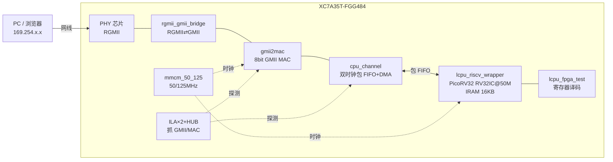

# RISC-V WebSoC — 上台演讲全材料

> 适用场景:项目汇报 / 技术分享 / 答辩。
> 本文包含:电梯演讲 → 讲稿主线 → 数字备查卡 → 现场 Demo 动线 → **六大类预设提问与答题要点** → 容易被追问处的兜底话术。
> 所有数字均核对自代码与文档(截至 2026-08-26),可直接引用。

---

## 〇、三个版本的一句话定位(开场前先想清楚用哪个)

**技术版**:
「我在一块 XC7A35T 上,围绕 PicoRV32 软核,从零手写了以太网 MAC、包 FIFO 数据通路和一套裸机 TCP/IP + HTTP 协议栈——让 FPGA 插根网线就能被 Ping 通、能跑 TCP 连接、能用浏览器访问内置控制面板,并且改固件不需要重新编译比特流,JTAG 秒级外灌。」

**价值版**:
「这个项目把『CPU 如何联网』这条完整链路——从 RGMII 引脚到浏览器页面——每一层都自己实现了,所以每个设计决策我都能讲到寄存器和时序级。」

**简短版**(主持人只给 30 秒时):
「一块 Artix-7 + 一个开源 RISC-V 软核 + 一套完全手写的 TCP/IP 协议栈,FPGA 变成了一台可以通过网页远程控制的设备。」

⚠️ 注意:`doc/PROJECT_OVERVIEW.md` 里写着「HTTP 待实现」,那已过时——现在 `http.c` + `tcp.c` 已有完整控制面板(GET/POST、寄存器读写、LED 控制)。**上台请按已实现来讲**,但准备好一句话解释版本差异:「早期阶段文档,后来补上了」。

---

## 一、电梯演讲(45 秒版,建议背熟)

> 大家好,我演示的项目叫 RISC-V WebSoC。
>
> 它解决的问题是:**不用任何现成网络协议栈、不用软 IP 库,让一块 FPGA 从物理层接口一路到浏览器页面,每一层都由自己实现。**
>
> 硬件侧,XC7A35T 上实例化了 PicoRV32(RV32IC @50MHz),外部 PHY 走 RGMII 进来,先经 RGMII-GMII 桥转成内部 8 位 GMII,再进自研 MAC;MAC 和 CPU 之间是一条带包管理的双时钟包 FIFO 通道,CPU 通过寄存器总线直接读写收发包,**全程零拷贝、不用内存缓冲区**。
>
> 软件侧,我用裸机 C 写完了 ARP、IP、ICMP、TCP 和 HTTP 五层:TCP 是 7 状态机,支持四次挥手、超时重传和保活回收;HTTP 提供 GET/POST 的寄存器读写控制面板。
>
> 最后还有个工程效率亮点:**JTAG-AXI 外灌固件**——换一版固件不用重跑 Vivado 综合,几秒钟直接写进指令 RAM。
>
> 74 次提交、五套单元仿真 Testbench、七阶段实机验证清单,这就是这个项目的全部内容。

---

## 二、10 分钟讲解主线(分幕脚本)

### 第 1 幕(1 min):动机与目标

- 问题引入:「任何一个 SoC 都要回答两个问题——**程序怎么进来,数据怎么进出**。这个项目给这两个问题都造了自己的答案:程序通过 JTAG 外灌,数据通过手写的 TCP/IP。」
- 目标三条:① Ping 得通(ARP/IP/ICMP);② TCP 站得住(完整状态机);③ 浏览器打得开(HTTP 控制面板)。

### 第 2 幕(2 min):系统架构(对着架构图讲)



讲解顺序:**沿数据流走一遍**。强调三个设计决策:
1. **PHY 用 RGMII(引脚少),MAC 内部统一 GMII(逻辑简单)**——复杂度关在桥接模块里;
2. **CPU 时钟域 50M、MAC 时钟域 125M**,跨域全部收口在 cpu_channel;
3. **ILA 插在 GMII 入口和 MAC 接口两处**,任何网络异常第一眼就能定位到「PHY 桥的问题还是 MAC 的问题」。

### 第 3 幕(2 min):地址映射(体现工程严谨度,提前背这张表)

| 地址 | 含义 |
|---|---|
| `0x00010000` | 指令 RAM(4096 字 = 16KB),JTAG 外灌的目标 |
| `0x80000000` | LCPU 寄存器基址(C 侧 `_RD/_WR` 宏基准) |
| `0x80006000+i` | RX 包 FIFO(empty/pop/pkt_len/addr/data…按字偏移) |
| `0x80006100+i` | TX 包 FIFO(同构) |
| 字偏移 `0x10`(即 `0x80000040`) | LED[3:0] |
| 字偏移 `0x100` | CPU 复位门控(JTAG 灌固第一步就是写 0 关住它) |

一句话过渡:「这套映射意味着——**对 FPGA 来说,‘收到一个网包’等于‘某个寄存器说 FIFO 非空’;对 CPU 来说,‘回一个包’等于‘往另一组寄存器写几个字’。** 网络在这里没有任何魔法,就是内存读写。」

### 第 4 幕(2.5 min):固件协议栈(项目的灵魂)

数据流(main.c 主循环):

```
主循环: tcp_periodic_check() 保洁 → 读 RX FIFO → eth_proc()
          ├─ ARP  → arp_reply()          应答
          ├─ IP   → ip_proc()
          │         ├─ ICMP → icmp_reply()   Ping 应答
          │         └─ TCP  → tcp_handler()  7 状态机
          └─ 其他 → 丢弃
```

必须讲的四个设计原则(原话来自代码注释,答辩时说出来非常加分):
1. **零拷贝**:RX/TX FIFO 直接读写,不做内存缓冲;
2. **REN 永不开关**:读使能恒为 1,消掉一组握手;
3. **每帧 POP 两次**:头部 POP 取数、尾部 POP 推进下一包;
4. **边解析边预写**:`eth_proc()` 在判断以太类型的同时就把应答 MAC 头写进了 TX FIFO。

TCP 状态机要点(`tcp.c`,监听端口 80,并发 MAX_CONNECTIONS=4):
- **三次握手**:CLOSED 收 SYN → SYN_RECEIVED 回 SYN+ACK → 收 ACK 进 ESTABLISHED;
- **两次关闭路径**:对方先 FIN → LAST_ACK;己方先关 → TIME_WAIT(**2 秒**回收,非标准 2MSL,现场一定会被问,答案见 Q&A-B5);
- **自建保洁**:`SYN+ACK 重传 3 次 × 3s`;**空闲 6s** 无活动发 RST 踢连接;TIME_WAIT 定时回收;
- **HTTP 融合在 TCP 层**:ESTABLISHED 后按 GET/POST 分派——GET `/set?addr=..&data=..&mode=read/write` 直接读写寄存器并返回 JSON 式响应页;POST 支持 form-urlencoded 与 JSON 两种字段提取(`tcp_find_form_field/tcp_find_json_field`);发送走 `send_http_data()` 按 MSS=1460 分段。

### 第 5 幕(1.5 min):JTAG-AXI 外灌固件(全场最容易被记住的点)

讲故事式讲:「以前每改一行 C 就要重跑一次 Vivado 全流程。后来我把这个问题拆掉:留一条 JTAG-AXI 通道,配一个四步 Tcl 流程——」
1. 写 `0x100=0`:按住 CPU 复位(顺带复位网络 FIFO,防 PHY 广播包写满);
2. `source fw_axi_body.tcl`:`bin_to_jtag_tcl.py` 把固件 bin 变成的写序列,逐字写入 IRAM;
3. 写 `0x100=1`:释放复位,PC=0 开始执行;
4. 写 LED 值验证链路活着。
配套还有 `verify_fw.tcl` / `read_back.tcl` 做回读校验。收效:**改固件迭代从「小时级综合」降到「秒级」,这是整个开发节奏能滚起来的前提。**

### 第 6 幕(1 min):验证体系(三层,证明可信度)

| 层 | 手段 | 覆盖 |
|---|---|---|
| 单元仿真 | Verilator/Icarus:tb_tcp_handshake / tb_cpu_channel_pkt / tb_http / tb_webserver_cpu_top / test_arp | 模块级 |
| 整机联调 | ILA(2048 深度 @50MHz,抓 gmii_rxd/txd、mac_sop/eop 等)+ Wireshark 对照 | 物理层到协议层 |
| 实机验收 | 七阶段清单(下节) | 端到端 |

### 第 7 幕(0.5 min):工程过程数字收尾

- 74 commits / 2026-08-03 → 08-26 连续推进,每次提交配日报复盘;
- 局限坦白(主动说!):无滑动窗口、无拥塞控制、百兆速率、4 并发——**引出下一步计划,把场面收在自己手里**。

---

## 三、数字备查卡(打印带进场,随口引用不出错)

| 项 | 值 | 出处 |
|---|---|---|
| 器件 | XC7A35T-FGG484-2(Artix-7) | doc |
| CPU | PicoRV32,rv32ic,50 MHz | PROJECT_OVERVIEW |
| 时钟 | 50M(CPU)/125M(MAC),mmcm_50_125 | rtl |
| IRAM | 4096 字 × 32bit = 16KB @0x10000 | webserver_cpu_top.v:46 |
| 监听端口 | **80**(HTTP) | tcp.c:648 |
| 并发连接 | MAX_CONNECTIONS = 4 | tcp.h:10 |
| MSS | 1460 字节 | tcp.c |
| SYN+ACK 重传 | 3 次 × 3s | PROJECT_OVERVIEW |
| 空闲踢 | 6s 无活动发 RST | 同上 |
| TIME_WAIT | 2s 自动释放 | 同上 |
| RX 包长合法性 | ≤2048 字节,否则丢弃 | main.c |
| FPGA IP / MAC | 169.254.1.1(link-local 免配置)/ 00:00:01:02:04:05 | lcpu_general.h |
| 速率 | 百兆演示 | PROJECT_OVERVIEW |
| ILA | 2× soft_ila + hub,2048 深度 @50MHz | signals.json |
| 版本史 | 74 commits,08-03 → 08-26 | git log |

---

## 四、现场 Demo 动线(带板子时的黄金 90 秒)

1. **Ping**:`ping 169.254.1.1` →ARP/ICMP 应答,同时指着流水灯说「心跳,被 TCP 接管时会自动让路」;
2. **TCP**:`nc 169.254.1.1 80` 敲一个 GET → 屏幕吐出 HTML;
3. **浏览器高光时刻**:打开 `http://169.254.1.1` → 深色控制面板 → 点 ALL ON/OFF、寄存器 Read/Write;
4. **杀招(可选)**:改一处 C 代码 → `make && vivado -source jtag_load_fw.tcl` → 观众眼皮底下秒级换固件;
5. Wireshark 投屏三次握手 + 四次挥手截图作背景板备用。

断网备案:全程录屏 + ILA 波形截图各存一份;板子不在就放 doc/http_control_panel.png。

---

## 五、预设提问与答题要点(Q&A 军火库)

### A 组 · 架构选型类

**A1. 为什么用 PicoRV32,不用 Zynq 硬核 / MicroBlaze / VexRiscv?**
要点:PicoRV32 MIT 开源、数千行可通读到底、RV32IC 够用、LUT 占用小、教学/审计可控;MicroBlaze 黑盒不可学,Zynq 是「调用 ARM」不是「造 CPU 系统」;本项目目标恰是把总线、RAM、加载每一环都握在自己手里。

**A2. 为什么手写 TCP/IP,不用 lwIP/uIP?**
要点:三个理由——① 学习目标是每层协议;② 架构上我的数据通路是「寄存器直读包 FIFO 零拷贝」,lwIP 的 pbuf 堆模型不适配且依赖较完整的 libc;③ 资源预算下 lwIP RAM 需求偏大。可以补一句「参考过嵌入式 TCP 面试总结里的轻量设计法」体现调研。

**A3. 为什么 PHY 是 RGMII,内部却用 GMII?**
要点:RGMII 4bit DDR 省引脚但需要 IDELAY/ODDR 时序校准;GMII 8bit SDR 让 MAC 逻辑最简。复杂度封装在 rgmii_gmii_bridge 内,MAC 与介质解耦,将来换 SGMII 只动桥。

**A4. 只有 100Mbps,为什么不上千兆?**
要点:瓶颈明确——包头解析、校验和在 50MHz 软件单周期逐字节处理;百兆验证架构完整性,千兆路线已想好:帧头/CRC 硬化 + FIFO 加宽 + CPU 只拿元信息。(参考姊妹项目 fpga_webserver 的 MAC 统计计数器思路)

**A5. 4 个并发连接怎么定的?**
要点:每个连接十来个 32bit 状态字,4 连接成本可忽略,真正的约束是场景——控制面板是短交互;4 只是第一档水位,扩容只是数组加一行。

### B 组 · TCP 协议细节类(最凶险的一组)

**B1. 有没有滑动窗口/拥塞控制?没有,凭什么能工作?**
要点:坦白没有。能工作的前提是「请求-应答」式短交互 + stop-and-wait:每次回复都不超过对端通告窗口(远端通常给满窗)。拥塞控制在局域网点对点直连下几乎不会被触发。改进:conn 表加 snd_wnd/rcv_wnd 字段 + 发送端限额即可升级。

**B2. 丢包怎么办?**
要点:当前仅 SYN+ACK 有重传(3×3s);数据段不做通用重传,依赖本端快速反馈场景(局域网丢包率≈0)。若要补:序号已在(conn_snd_seq/rcv_ack),补一个「超时未 ACK 则重发最后一段」的定时分支即可,保洁定时器框架现成。

**B3. ISN(初始序列号)怎么生成?会不会被预测?**
要点:如实说——当前为简化实现是固定/低熵值,**安全上确实不合格**;生产做法是时钟混合熵源。这是已知边界,列进 TODO。

**B4. 校验和在哪算?性能如何?**
要点:C 软件 16 位反码累加(comlib.c cks_sum_cal),边从 FIFO 读边累加,不落缓冲;IP 头含伪首部重构。开销大约每字节若干指令周期,50MHz 下支撑百兆短包场景够用,千兆不行——呼应 A4。

**B5. TIME_WAIT 为什么 2 秒,不是标准的 2MSL?**
要点:2MSL 里 MSL 在局域网几十微秒量级,2 秒已是数百倍冗余,安全回收旧四元组的目的一致;等价换算是 consciously shortened 的参数化决定,不是不懂标准。这题是「故意缩短」的故事,讲出来反而加分。

**B6. 空闲 6s 为什么发 RST 而不是优雅 FIN?**
要点:四路并发保护——半死连接占槽会饿死新连接,RST 立即释放且无需等待对端配合,语义上是「服务器回收僵死资源」。代价是对端可能看到错误提示,可接受。

**B7. 连接怎么查表匹配?**
要点:find_connection 按 源IP+源端口+两端端口 三元匹配(本端 IP 恒定),O(N) 线性扫,N=4 无所谓;N 大了才需要哈希——git log 里正好有一条学习哈希表的日报,可以顺势展示工程意识。

**B8. 乱序/重复包呢?**
要点:不支持重组,序列号只用于确认累计边界;局域网内交换机保序,真实乱序概率极低。如实承认 + 给出「缓存一小段 OOO 区」的升级思路。

### C 组 · 硬件时序类

**C1. 50M↔125M 跨时钟域怎么处理的?**
要点:三类手段——包数据走异步 FIFO(dual_clock_fifo,格雷码指针);单 bit 事件走 pulse_clock_region_pass(脉冲同步);慢速标量统计走采样+多级同步。RTL 里 dual_clock_simple_dual_port_ram 等模块名可以直接报出来。

**C2. 「双 POP」到底解决什么问题?**
要点:FIFO 侧「包管理」和「数据搬运」分离:第一次 POP(rpkt_pop)宣告取走本包包描述并预置读地址,第二次 POP 前移到下一包边界。这样 CPU 可以随机访问包内任意字节而不破坏队列连续性——是「FIFO 里也能随机读」的关键。

**C3. JTAG 往 IRAM 写时 CPU 正在取指怎么办?**
要点:不会发生——外灌第①步先写 0x100=0 按住复位,CPU 停止取指;IRAM 是真双口 RAM,一口归 JTAG、一口归总线,写期间无竞争。这也是为什么注释特意写「同时复位网络 FIFO,防 PHY 广播包把 FIFO 写满」。

**C4. 复位策略?**
要点:PLL locked 门控 + 异步复位同步撤离;CPU 复位做成总线可写寄存器(0x100),所以软件和 JTAG 都能热复位 CPU——这是外灌机制的地基之一。

**C5. 听说你被仿真库坑过?(字节序事件)**
要点:正面认领——共用库的旧快照 BFM 字节序与现行 RTL 不一致,曾让正确 RTL 假报字节序错误;教训是「先验证据链的新鲜度,再信失败结论」,此后 fpga_golden 快照作为唯一运行手册基准。展现调试方法论。

### D 组 · 工程方法类

**D1. 你怎么知道它是“对”的?验证金字塔讲一下。**
用第二节第 6 幕的三层表格回答,并补一句闭环:仿真发现波形、Wireshark 解释线上行为、ILA 定位物理层争议。

**D2. JTAG-AXI 外灌和 bitstream 内嵌固件(init mem)有什么区别?何时选谁?**
要点:内嵌式适合出货量产;外灌式适合开发迭代和现场升级,不必重综合、还可在线替换固件(相当于 bootloader 思路)。仓库里同时保留两类 bit 就是两种模式的共存证据(fw.bit vs 纯硬件 bit)。

**D3. ILA 为什么抓 GMII 又抓 MAC 接口两组?**
要点:两个探针夹住 gmii2mac——上游异常说明 PHY/桥问题,下游异常说明 FIFO/CPU 问题,二分定位;这也是 C1 的实践注脚。

**D4. 项目管理方式?**
要点:74 commits,每日提交日报(git log 全是 doc: XX日报),文档与代码同步演进(LLD 方案文档 ED002R01、PingREADME、JTAG 原理文)。演讲时点出「docs as commit」的习惯即显成熟。

### E 组 · 延伸与展望类(用来收尾)

**E1. 下一步做什么?**
推荐口径(按现实优先级):① HTTP 面板增强(URL 解析健壮性、更多寄存器暴露);② 数据段重传 + 滑动窗口;③ UDP + DNS 一条龙做一个 NTP 对时;④ 中断驱动替代轮询(PicoRV32 IRQ 已留参数);⑤ 帧 CRC/头部硬化冲刺千兆。

**E2. 安全性评估?**
主动交代:无 TLS(明文面板)、无 ARP 防欺骗、SYN Flood 可打满 4 槽(但有 9s 上限自动回收)、ISN 低熵。给出边界感而非回避——「它是实验台,不是防火墙;但这些威胁模型我都想过了」。

**E3. 如果给你两周,最先改哪一件事?**
好答案:数据段超时重传。理由:改动面最小(tcp.c 单文件、复用保洁定时器)、可靠性收益最大,而且做完之后滑动窗口的地基就齐了。

---

## 六、容易露怯的点 · 兜底话术

| 若被问 | 千万别说 | 兜底说法 |
|---|---|---|
| 乱序重组/窗口细节支吾 | 「嗯…应该支持吧」 | 「这块是刻意没做的,取舍原因是……(B1/B8),升级方案我想好了是……」 |
| HTTP 合规程度 | 「完整实现了 HTTP」 | 「实现了控制面板级的 GET/POST:URL 参数解析 + form/JSON 字段提取 + MSS 分段发送;管线、Cookie、分块编码不在目标内」 |
| 与 PROJECT_OVERVIEW 文档矛盾 | 无言以对 | 「那是阶段文档,协议栈后续迭代快于文档,提交记录可追溯」 |
| 字节序/BFM 历史事故甩锅 | 「工具的锅」 | 「教训在我:以后接手任何环境先核对依赖快照新鲜度」 |
| 千兆可行性拍胸脯 | 「换个频率就行」 | 「频率只是一角,IDELAY 校准、FIFO 宽度、软件逐字节路径都是约束,方案见 A4」 |

---

## 七、收尾金句(任选其一)

1. 「这个项目最大的产出不是那个网页,而是让我搞清楚了**每一个 TCP 包在 FPGA 里的物理形态是什么**。」
2. 「从 RGMII 的第一根差分线,到浏览器的最后一个字节,中间没有一层是我不能打开的。」
3. 「74 次提交里我学会的最重要的三件事:跨时钟域要敬畏、验证要分层、以及——改固件的路修得越快,创新的次数越多。」

---

*文档生成于 2026-08-27,所有数字已对照仓库代码核实。*
